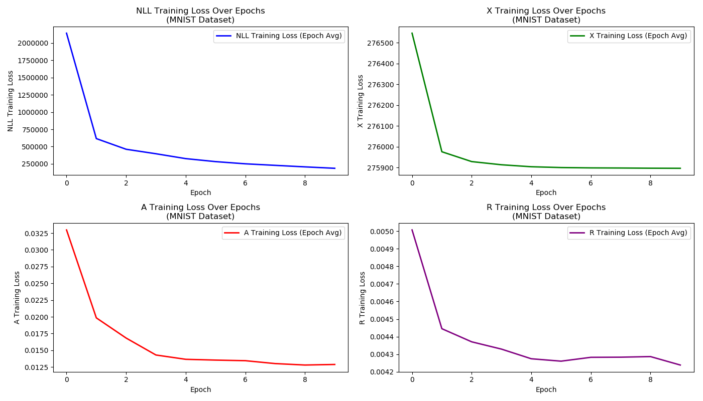

# Deconfounding Reinforcement Learning (DRL)
This repository contains a clean version of the code for the Deconfounding Reinforcement Learning (DRL) 
model as developed at [1]. The code is easy to modify for your own applications. It is
worth noting that this is my first work within the charming but mysterious kingdom of Causal Reinforcement
Learning (CausalRL). Undoubtedly, CausalRL will become an indispensable part of
Artificial General Intelligence (AGI). Please refer to [CausalRL](https://causallu.com/2018/12/31/introduction-to-causalrl/) for more details.

## Running Environment
Only tested the codes on 
+ Tesla P100 with 16GB GPU memory 
+ tensorflow-gpu v1.5.1. 

Not sure about other options.

## Data Format
In default the data are organised as follows. Feel free to modify these parameters for your own applications.

                         num    x    nsteps   x      dim
    x_train:           140,000          5            784
    a_train:           140,000          5             1
    r_train:           140,000          5             1
    mask_train:        140,000          5             1
    x_validation:       28,000          5            784
    a_validation:       28,000          5             1
    r_validation:       28,000          5             1
    mask_validation:    28,000          5             1
    x_test:             28,000          5            784
    a_test:             28,000          5             1
    r_test:             28,000          5             1
    mask_test:          28,000          5             1
    
N.B. 1st dim: the number of sequences; 2nd dim: steps of one sequence; 3rd dim: dim of data.
### Installation

1. **Clone the repository:**
    ```bash
    git clone (https://github.com/evcco/DRL-1)
    cd drl
    ```

2. **Create and activate the Conda environment:**
    ```bash
    conda create -n deconf_rl python=3.7
    conda activate deconf_rl
    ```

3. **Install the required packages:**
    ```bash
    pip install -r requirements.txt
    ```
4. **create the datasets using:**
    ```bash
    python create_mountaincar_data.py
    ```
5. **Update Config.py according to which dataset you chose:**
     
## How to Run
This repo consists of three folders:
+ **model_decon_uGaussian**: learning M_Decon when the dimension of u is set to 2 and the prior over u is assumed to be a factorised standard Gaussian.
  >python run.py
+ **model_decon_uBernoulli**: learning M_Decon when the dimension of u is set to 1 and the prior over u is assumed to be a Bernoulli with p=0.5.
  >python run.py
+ **ac_decon**: learning and testing AC_Decon (In default M_Decon learned in **model_decon_uBernoulli** is required).
  >python train_policy.py
  
  >python test_policy.py
  
Note that before running the code, you are supposed to modify `configs.py`, especially the following lines which involve 
the directories of data and models. 

```python
########################################## data and model path Configuration ###########################################

model_config['work_dir'] = './training_results'
model_config['data_dir'] = './dataset'
model_config['training_data'] = './dataset_training_data.npz'
model_config['validation_data'] = './dataset_validation_data.npz'
model_config['testing_data'] = './dataset_testing_data.npz'
model_config['model_checkpoint'] = './training_results/model_checkpoints/model_alt'
model_config['policy_checkpoint'] = './training_results/policy_checkpoints/policy_alt'

########################################################################################################################
```
### Results
#### Model_Decon Training Metrics

During the training of the `Model_Decon`, several key metrics are logged to monitor the model's performance. These metrics are saved in the log file (`mnist.log`) located in the specified directory. Below is a brief explanation of each metric:

1. **Negative Log Likelihood (nll_tr)**:
   - This metric represents the negative log-likelihood of the training data given the model's parameters. It measures how well the model predicts the training data. Lower values indicate better model performance.

2. **Reconstruction Losses**:
   - **x_tr_loss**: Measures the reconstruction loss for the states (x). Indicates how well the model can reconstruct the input states from the latent representation.
   - **a_tr_loss**: Measures the reconstruction loss for the actions (a). Indicates how well the model can reconstruct the actions taken in the environment.
   - **r_tr_loss**: Measures the reconstruction loss for the rewards (r). Indicates how well the model can reconstruct the rewards received.

3. **KL Divergence**:
   - `kl_dist`: Represents the Kullback-Leibler (KL) divergence between the approximate posterior distribution and the prior distribution for the latent variables. Lower values indicate a better approximation of the posterior.

4. **KL Divergence for u**:
   - `u_kl_divergence`: Measures the KL divergence for the variable `u`. Indicates how much the distribution of `u` diverges from its prior distribution. Lower values indicate a better approximation.

5. **Accuracy of u**:
   - `u_accuracy`: Measures the accuracy of the predictions for `u`. Indicates how well the model predicts the binary variable `u`.

These metrics provide a comprehensive view of the model's training process, helping to understand how well the model is fitting the training data, reconstructing the input data, and approximating the latent variables.

The results, including training metrics and generated plots, will be saved in the `plots` directory.

### Plots

The plots generated during training will be saved in the `plots` directory with filenames indicating the epoch and iteration number. For example for a modified MNIST dataset amd Model_Decon_UBernoulli:



The following is the rewards per episode for each for Vanilla AC Networks vs AC Networks with Deconfounding Model.


## References

[1] [Deconfounding Reinforcement Learning in Observational Settings](https://arxiv.org/abs/1812.10576)
Chaochao Lu, Bernhard Schölkopf, José Miguel Hernández-Lobato, 2018

